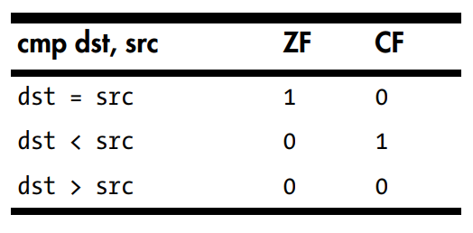

### Introduction

If you are not familiar with Assembly or you think that you need to refresh your knowledge, read [this](http://ian.seyler.me/easy_x86-64/)
(or any other) quick introduction to the language.

### "Naive" solution

#### C++

Below we have simple `c++` implementation of a function that iterates through a *string* and returns a pointer to the new line character in this string 
(or pointer to some value after the string, in case the new line character was not found). 
The *string* is exposed as an array of 8 bit(1 byte) integers (a.k.a. chars).
The `iter` variable points to the place in memory where the *string* (char array) begins, the `limit` points at the byte after the last
character of the *string* (char array).

Here we assume that the characters in the *string* are ASCII encoded (i.e. each character is encoded in one byte).
So every time we perform `iter++` we move our pointer to the next cell in memory (which means next character in the string). 
In every iteration we also check if the **value** of the pointer isn't equal to the new line sign (iter!='\n').

```c++
uint8_t* findNl(uint8_t* iter, uint8_t* limit) {
   while (iter<limit && *iter!='\n')
     iter++;

   return iter;
}
```

#### Assembly

This is how this function looks compiled to assembly code.
We have 14 lines of code (4 labels are there only for human readability), let's try to go through them step by step.

1.  The first six integer or pointer function arguments are passed in registers `RDI`, `RSI`, `RDX`, `RCX`, `R8`, `R9`.
    So here `cmp` compares `iter` with `limit`.
    This is an optimization trick, and it might not be the case for all processors/compilers/platforms (however it is here).
    The `cmp` operation sets appropriate flag registers depending on the result of comparison
    
    
    Those flags can later be used by *jump* instructions (line 3)
2.  The `rax` register should contain the return value of the function (again, this is just convention and it's not universally true)
    so we `mov`e the value of `iter` there, as this is the value we want to return in the end

3. Now we use the result of `cmp` from the first line the *jump if not below* (`jnb`) to the .L6 which means we just return.
   So if `rdi` a.k.a. `iter` is not below `rsi` a.k.a. `limit` we can finish the execution.
   
4. Compare the *byte* value under `rdi` (value in cell where `rdi` points) to the new line character

5. *Jump if not equal* to the .L4. So if `rdi` value in previous line turned out not to be equal to the new line we go to the line 10

6. *Jump* to .L1. Unconditionally, if we didn't jump in the previous line, no we go to the .L1 and function returns.

7. Label 

8. Compare the *byte* value under `rax` (which represents the `limit` variable) to the new line character (second `while` condition)
    
9. *Jump if equal* to the .L1. So if  `rax` value is new line, then the loop and function end.  

10. Label

11. Add 1 to `rax` means move the pointer to the next byte in the string. **The function processes 1 byte per loop**

12. Compare `rsi` with `rax` means compare `limit` with `iter` (first `while` condition)

13. *Jump if not equal* to the .L5. So This is the place where the function falls in to the loop. If the `iter` is not equal to the `limit`
    (which means we didn't process the whole string yet) the execution goes back to .L5, otherwise it follows to the next instruction.

14. This, and all the subsequent instructions cause the function to return with value currently stored in `rax`

```asm
1         cmp     rdi, rsi ; rdi contains first argument, rsi second
2         mov     rax, rdi ; move rdi to rax
3         jnb     .L6      ; jump not below, cmp rdi, rsi = rdi - rsi, we want rsi (a.k.a. limit )to be greater than rdi (a.k.a. iter), so this will set CF=0 (no carry if rdi > rsi) and we can finish
4         cmp     BYTE PTR [rdi], 10 ; compare with new line
5         jne     .L4 ; if not new line goto L4
6         jmp     .L1 ; return
7     .L5:
8         cmp     BYTE PTR [rax], 10
9         je      .L1
10    .L4:
11        add     rax, 1
12        cmp     rsi, rax
13        jne     .L5
14       rep ret
15    .L1:
16       rep ret
17    .L6:
18       rep ret
```

If we now take a closer look at the 14 instructions that were generated here we will see that instruction 1-6 are kinda "preparatory" steps.
They are executed only once, when the execution enters the function.

The instructions 14,16 and 18 are executed only once, when the execution is done and the function returns. 

Only the instructions 8,9,11-13 (5 in total) are executed in the loop. The loop continues until the new line character is found 
(or the string finished), so we can say that, we perform 5 instructions per non new line character.
(We don't count instructions that are performed only once.)

#### bitwise version

The goal of this function is exactly the same as the "naive" implementation. Return the pointer to the new line character in the given string.
Technically it works exactly the same as the one we developed on the previous tutorial (the implementation is slight different, but the logic is exactly the same).

It's more complex and complicated than the "naive" version. However is has one big advantage: `iter+=8` vs `iter++` in the "naive" version.

It means that in every iteration of the `while` loop we move by **8** bytes (not 1 like in the naive version).


```c++
uint8_t* findNlBinary(uint8_t* iter, uint8_t* limit) {
   while (iter<limit) {
     uint64_t block=*reinterpret_cast<const uint64_t*>(iter);
     constexpr uint64_t highBits=0x8080808080808080ull;
     constexpr uint64_t lowBits=0x7F7F7F7F7F7F7F7Full;
     uint64_t lowChars=(~block)&highBits;
     uint64_t matches0A=~((((block&lowBits)^0x0A0A0A0A0A0A0A0Aull)+lowBits)&highBits);
     uint64_t matches=matches0A&lowChars;
     if (!matches) {
       iter+=8;
       continue;
     }
     iter+=__builtin_clzll(__builtin_bswap64(matches))>>3;
     return iter;
   }

    return limit;
}
```

But is that really faster? Yes we move 8 bytes per loop, which means we need 8 times less loops to process whole string. 
However, there is much more code inside this loop (13 lines vs 3 lines in the "naive" version). 

One way to check why this version is faster, is to take a look at the assembly code that compiler generates.

The

```asm
findNl(unsigned char*, unsigned char*):
1         cmp     rdi, rsi
2         mov     rax, rsi
3         jnb     .L2
4         mov     rcx, QWORD PTR [rdi]
5         movabs  r8, 9187201950435737471
6         movabs  r9, 723401728380766730
7         movabs  rsi, -9187201950435737472
8         mov     rdx, rcx
9         and     rdx, r8
10        xor     rdx, r9
11        add     rdx, r8
12        jmp     .L11
13    .L14:
14        add     rdi, 8
15        cmp     rax, rdi
16        jbe     .L13
17        mov     rcx, QWORD PTR [rdi]
18        mov     rdx, rcx
19        and     rdx, r8
20        xor     rdx, r9
21        add     rdx, r8
22    .L11:
23        and     rdx, rsi
24        not     rcx
25        not     rdx
26        and     rcx, rsi
27        and     rdx, rcx
28        je      .L14
29        bswap   rdx
30        bsr     rdx, rdx
31        xor     rdx, 63
32        sar     edx, 3
33        movsx   rdx, edx
34        lea     rax, [rdi+rdx]
35    .L2:
36        rep ret
37    .L13:
38        rep ret
```

**1 - 4** Those lines are very similar to the "naive" case

**5 - 7** In the code we use 3 constants `0x8080808080808080ull`, `0x7F7F7F7F7F7F7F7Full`, `0x0A0A0A0A0A0A0A0Aull`. In those lines
    They are put into the registers from where it will be easy for processor to access them.
    
**8 - 11** Here operations `((block&lowBits)^0x0A0A0A0A0A0A0A0Aull)+lowBits` are performed. We see `and`  = `&`, `xor` = `^` and `add` = `+`

**12** Unconditional *jump* to .L11, where the "bit trick" continues

**13** Label

**14** This is the "crucial" place int the loop. This operation corresponds tho the `iter+=8` and moves the pointer
    by **8** bytes.
    
**15** Compare `rax` with `rdi` means compare `limit` with `iter` (here `rdi` corresponds to `iter` and `rax` to `limit`)

**16** *Jump if below or equal* to the .L13. If `limit` is below or equal to the `iter` finish the execution.

**17 - 21** and **23 - 27** correspond to following operations in the `c++` code:

```c++
    uint64_t lowChars=(~block)&highBits;
    uint64_t matches0A=~((((block&lowBits)^0x0A0A0A0A0A0A0A0Aull)+lowBits)&highBits);
    uint64_t matches=matches0A&lowChars;
```
**28** *Jump if equal* to .L14. So This is the place where the function falls in to the loop. If the previous instruction `and     rdx, rcx`
    resulted in `0` (which mean `matches` are empty (no new line found)) appropriate flag was set and the *jump* instruction will move
    the execution to label .L14.
    
**29 - 34** Those instructions prepare appropriate return value. They correspond to this instruction: `iter+=__builtin_clzll(__builtin_bswap64(matches))>>3;`
    Check [here](https://gcc.gnu.org/onlinedocs/gcc/Other-Builtins.html) to read more about builtin instructions.

**30 - 34** Labels and return statements.
      
      
If we now take a closer look at the 34 (38 lines - 4 labels) instructions that were generated here we will see that instruction 1-12 are kinda "preparatory" steps.
They are executed only once, when the execution enters the function.

The instructions 29-34,36 and 38 are executed only once, 

Only the instructions 14-21 and 23-28 (14 in total) are executed in the loop. The loop continues until the new line character is found 
(or the string finished), so we can say that, we perform 14 instructions per loop. But since we consider **8** bytes per loop it means
that we perform **1.75 instruction per character**.
(We don't count instructions that are performed only once.)

#### Summary

Bitwise solution despite being longer (in terms of code) and more complex, requires less assembler instructions **per byte**. This is pretty good
explanation why when using this approach gives faster runtime.

